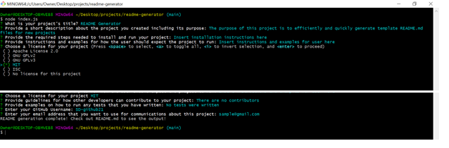
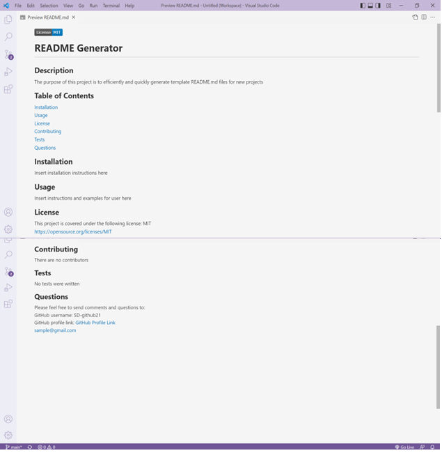

# **README Generator**

## **Overview**
The purpose of this project was to create an automated program that could generate README.md files for projects. This program would serve to assist developers with quickly and efficiently generating template README.md files for new projects. 

## **Table of Contents**
[User Story](#user-story) 
[Acceptance Criteria](#acceptance-criteria) 
[Installation](#installation) 
[Usage](#usage) 
[License](#license) 
[Contributing](#contributing) 
[Tests](#tests) 
[Assets Utilized](#assets-utilized) 
[Built With](#built-with) 
[Deliverable](#deliverable) 

### **User Story**
> AS A developer 
I WANT a README generator 
SO THAT I can quickly create a professional README for a new project 

### **Acceptance Criteria**
> GIVEN a command-line application that accepts user input 
WHEN I am prompted for information about my application repository 
THEN a high-quality, professional README.md is generated with the title of my project and sections entitled Description, Table of Contents, Installation, Usage, License, Contributing, Tests, and Questions 
WHEN I enter my project title 
THEN this is displayed as the title of the README 
WHEN I enter a description, installation instructions, usage information, contribution guidelines, and test instructions 
THEN this information is added to the sections of the README entitled Description, Installation, Usage, Contributing, and Tests 
WHEN I choose a license for my application from a list of options 
THEN a badge for that license is added near the top of the README and a notice is added to the section of the README entitled License that explains which license the application is covered under 
WHEN I enter my GitHub username 
THEN this is added to the section of the README entitled Questions, with a link to my GitHub profile 
WHEN I enter my email address 
THEN this is added to the section of the README entitled Questions, with instructions on how to reach me with additional questions 
WHEN I click on the links in the Table of Contents 
THEN I am taken to the corresponding section of the README 

### **Installation**
(1) Clone this repository on your local machine 
(2) Navigate to the repository folder 
(3) Type the following command in the command line to download the inquirer package: 

    npm install inquirer

### **Usage**
(1) Navigate to the folder in which the project files are stored and run the following in the command line: 

    node index.js

(2) Users will then be asked to complete a number of questions about their project. A sample screen shot of the application appears below:  

(3) Once all questions are answered, the README.md file will be automatically generated and stored in the "dist" folder of the project repository. 

(4) A sample README.md file has been stored within this repository and can be found . Below is a screen shot of a sample README.md file:

### **License**
There is no license for this project

### **Contributing**
This project does not include any contributors

### **Tests**
N/A

### **Assets Utilized** 

- index.js
- generateMarkdown.js

### **Built With**
* JavaScript
* Node.js
* npm
* Inquirer.js
 
 ### **Deliverable**

**Video of README Generator:** 

https://user-images.githubusercontent.com/85533099/168413156-665ddaac-3628-4cd3-b4f5-93f958cc29fe.mp4

